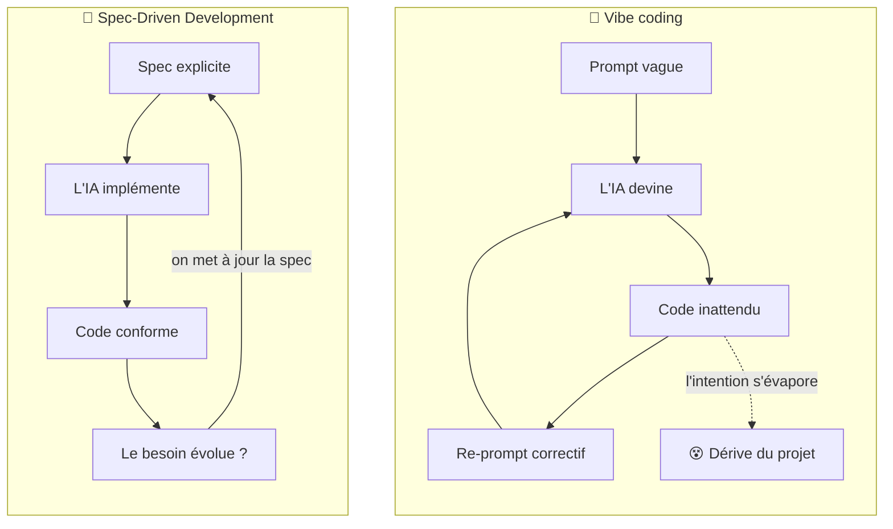
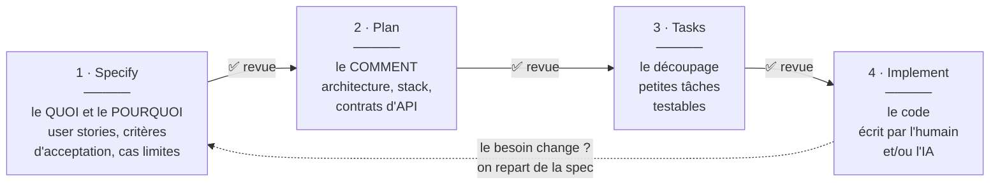
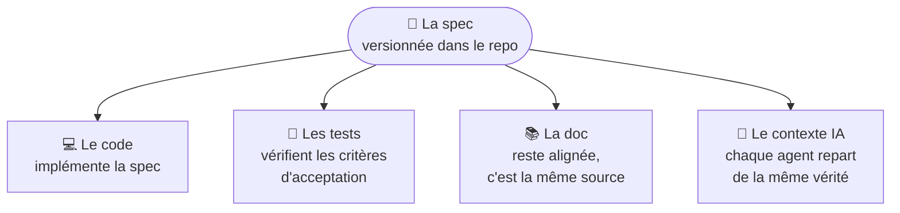

*Ou comment l’IA a remis au goût du jour une idée vieille comme le génie logiciel.*

---

Vous avez déjà demandé à une IA de vous coder une fonctionnalité, et obtenu… autre chose ? Quelque chose qui compile, qui a l’air correct, mais qui ne fait pas ce que vous vouliez ? Ce n’est pas (que) la faute de l’IA. C’est surtout la faute de la demande : on lui a donné une intention floue, elle a comblé les trous avec ses propres suppositions.

Le **Spec-Driven Development** (SDD) part d’un constat simple : si l’on veut qu’une machine — ou un humain — construise la bonne chose, il faut d’abord décrire précisément *ce qu’est* la bonne chose. Avant d’écrire la moindre ligne de code, on écrit une **spécification**. Et cette spec devient la source de vérité du projet.

## Le SDD, c’est quoi exactement ?

L’idée tient en une phrase : **la spécification n’est plus un document jetable qu’on écrit avant de coder, c’est l’artefact central du projet, dont le code découle.**

Une bonne analogie : la construction d’une maison. Personne ne demande à un maçon de « faire une maison sympa avec trois chambres » en le laissant improviser. On passe par un architecte, qui produit des plans. Les plans décrivent le *quoi* (les pièces, les surfaces, les contraintes) sans imposer chaque geste du maçon. Et si en cours de chantier on veut déplacer une cloison, on modifie **le plan d’abord**, pas le mur directement.

Le SDD applique la même logique au logiciel :

- On décrit le **comportement attendu** : les user stories, les critères d’acceptation, les cas limites, ce qui est hors périmètre.
- On en dérive un **plan technique** : l’architecture, les choix de stack, les contrats d’API.
- On découpe en **tâches** petites et vérifiables.
- Et seulement là, on **implémente** — soi-même ou, de plus en plus souvent, avec une IA.

Le point clé : quand le besoin change, on met à jour la spec, et le code suit. Jamais l’inverse.

## Pourquoi on en parle (beaucoup) maintenant

Écrire des specs avant de coder n’a rien de nouveau — le cahier des charges, le *Design by Contract*, les méthodes formelles existent depuis des décennies. Mais soyons honnêtes : dans la vraie vie, la spec finissait souvent dans un Google Doc oublié, obsolète dès le deuxième sprint.

Ce qui a tout changé, c’est l’arrivée des **agents de code IA**. En 2025, l’écosystème a explosé : GitHub a publié **Spec Kit**, AWS a lancé **Kiro**, un IDE entièrement pensé autour des specs, et des outils comme **Tessl** poussent l’idée encore plus loin. Pourquoi cet engouement soudain ?

Parce qu’une IA est un exécutant redoutable mais littéral. Elle fait exactement ce qu’on lui dit — et quand on ne dit pas, elle invente. Le phénomène du **vibe coding** (« je prompte, je regarde ce qui sort, je re-prompte ») est grisant sur un prototype, mais devient un cauchemar sur un vrai projet : chaque prompt est éphémère, l’intention se perd, et au bout de trois jours plus personne ne sait *pourquoi* le code fait ce qu’il fait.



Avec le SDD, le prompt jetable est remplacé par un document durable, versionné dans le repo, relu par l’équipe. La spec devient en quelque sorte **le prompt ultime** : structuré, complet, et réutilisable.

## Le cycle SDD en pratique

La plupart des outils (Spec Kit, Kiro…) convergent vers le même workflow en quatre phases, avec une validation humaine entre chacune :



### 1. Specify — décrire le quoi

On écrit ce que le produit doit faire, pour qui, et pourquoi. Pas de technique ici : pas de framework, pas de base de données. Des user stories, des critères d’acceptation, des cas limites (« que se passe-t-il si le panier est vide ? »), et — tout aussi important — ce qui est **hors périmètre**.

### 2. Plan — décider du comment

C’est ici qu’entrent la technique et les contraintes : la stack imposée, l’architecture, les standards de l’équipe, les contraintes de sécurité ou de conformité. Ce plan se dérive de la spec ; il ne la contredit jamais.

### 3. Tasks — découper

Le plan est décomposé en tâches petites, indépendantes et vérifiables. C’est exactement ce dont un agent IA a besoin : une tâche bien bornée qu’il peut implémenter *et* dont on peut vérifier le résultat. Une tâche trop grosse, c’est la porte ouverte aux hallucinations.

### 4. Implement — coder

L’implémentation devient presque la partie la plus simple. L’IA (ou le développeur) travaille tâche par tâche, avec la spec et le plan sous les yeux. Le rôle du développeur glisse de « celui qui tape le code » vers « celui qui vérifie que le code respecte la spec ».

## La spec comme source de vérité

Ce qui distingue vraiment le SDD d’un simple « on écrit un ticket Jira détaillé », c’est le statut de la spec. Elle vit dans le repo, elle est versionnée, et tout le reste en découle :



Trois conséquences concrètes :

- **La revue change de niveau.** Relire 40 lignes de spec en français, c’est plus efficace que relire 800 lignes de code généré. On attrape les erreurs de conception *avant* qu’elles ne coûtent cher.
- **La documentation ne ment plus.** Puisque le code dérive de la spec, la spec *est* la doc — et elle est à jour par construction.
- **L’onboarding s’accélère.** Un nouveau développeur (ou un nouvel agent IA !) lit la spec et comprend l’intention, pas seulement la mécanique.

## À quoi ressemble une spec ?

Pas besoin d’un document de 50 pages. Voici un extrait réaliste, façon Spec Kit ou Kiro :

```markdown
# Spec : réinitialisation de mot de passe

## Objectif
Permettre à un utilisateur de réinitialiser son mot de passe
sans contacter le support.

## User story
En tant qu'utilisateur ayant oublié mon mot de passe,
je veux recevoir un lien de réinitialisation par email,
afin de retrouver l'accès à mon compte en autonomie.

## Critères d'acceptation
- QUAND l'utilisateur soumet un email connu,
  ALORS un email avec un lien valable 30 minutes est envoyé.
- QUAND l'utilisateur soumet un email inconnu,
  ALORS le message affiché est identique (pas de fuite
  d'information sur l'existence du compte).
- QUAND le lien a expiré,
  ALORS l'utilisateur est invité à en redemander un.
- Le nouveau mot de passe doit respecter la politique
  de sécurité en vigueur (voir spec `password-policy`).

## Hors périmètre
- L'authentification à deux facteurs (spec dédiée à venir).
- Le changement d'adresse email.
```

Remarquez le format « QUAND… ALORS… » (inspiré de la syntaxe EARS, utilisée par Kiro) : chaque critère est **testable**, sans ambiguïté. C’est lisible par un product owner, un développeur… et une IA.

## Les avantages

- ✅ **L’intention est explicite.** Fini le code dont plus personne ne sait pourquoi il existe. La spec capture le *pourquoi*, le code n’exprime que le *comment*.
- ✅ **L’IA produit du code aligné.** Un contexte riche et structuré réduit drastiquement les hallucinations et les allers-retours de correction.
- ✅ **La collaboration s’améliore.** Product, dev, QA et IA travaillent sur le même document. Les désaccords se règlent sur la spec, pas en revue de PR à la veille de la mise en prod.
- ✅ **Les cas limites sont pensés en amont.** Écrire les critères d’acceptation force à se poser les questions qui fâchent avant de coder, pas après le bug en production.
- ✅ **Le travail devient parallélisable.** Des tâches bien découpées et indépendantes, c’est plusieurs développeurs — ou plusieurs agents IA — qui avancent en même temps sans se marcher dessus.

## Les limites (parce qu’il y en a)

Soyons honnêtes, le SDD n’est pas une baguette magique.

- ⚠️ **C’est un investissement initial.** Écrire une bonne spec prend du temps. Pour un prototype jetable ou un script de dix lignes, c’est disproportionné — le vibe coding reste parfaitement adapté à l’exploration.
- ⚠️ **Le risque du waterfall déguisé.** Si la spec devient un monolithe figé qu’on n’a plus le droit de toucher, on a juste réinventé le cycle en V avec des étapes en plus. Une spec doit rester vivante et itérative.
- ⚠️ **Une spec qui dérive est pire que pas de spec.** Si l’équipe corrige le code sans mettre à jour la spec, la « source de vérité » devient une source de mensonges. La discipline est non négociable.
- ⚠️ **On ne peut pas tout spécifier.** L’ergonomie fine, le « feel » d’une interface, les découvertes en cours de route… Certaines choses ne se révèlent qu’en construisant. La spec cadre, elle ne remplace pas l’itération.
- ⚠️ **Garbage in, garbage out.** Une spec ambiguë ou incomplète produit du code ambigu ou incomplet — avec l’assurance d’une IA qui ne doute jamais. La qualité de la spec devient LA compétence critique.

## SDD, TDD, BDD, vibe coding : qui fait quoi ?

Ces approches ne s’opposent pas, elles ne jouent simplement pas au même niveau :

| | **Vibe coding** | **TDD** | **BDD** | **SDD** |
|---|---|---|---|---|
| **L’artefact premier** | Le prompt (éphémère) | Le test unitaire | Le scénario Gherkin | La spec complète |
| **Répond à** | « Montre-moi vite » | « Le code est-il correct ? » | « Le comportement est-il le bon ? » | « Construit-on la bonne chose, et comment ? » |
| **Granularité** | L’instant | La fonction | La feature | Le produit / le système |
| **Idéal pour** | Prototypes, exploration | Qualité du code | Alignement métier | Travail avec des agents IA, projets d’équipe |

En pratique, ils se combinent très bien : une spec SDD dont les critères d’acceptation deviennent des scénarios BDD, implémentés en TDD. Chaque approche renforce l’autre.

## Mon retour d’expérience : Superpowers au quotidien

Petite confession : je ne suis pas arrivé au SDD par Kiro ni par Spec Kit, mais par [Superpowers](https://github.com/obra/superpowers), un plugin open source pour Claude Code — et je l’utilise encore tous les jours. C’est probablement la porte d’entrée la plus douce vers cette façon de travailler.

Superpowers encode le processus en « skills » : d’abord une phase de brainstorming socratique, où l’IA me pose des questions jusqu’à ce que l’intention soit vraiment claire ; puis la rédaction d’un plan détaillé, découpé en petites tâches ; enfin l’exécution tâche par tâche — souvent en TDD — avec un point de validation à chaque étape. Vous l’aurez reconnu : c’est exactement le cycle Specify → Plan → Tasks → Implement décrit plus haut.

La nuance avec Kiro ou Spec Kit : Superpowers est centré sur le **processus** plutôt que sur l’artefact. Le plan produit est un document de travail qui pilote l’implémentation ; il n’est pas forcément maintenu comme source de vérité une fois le code mergé. Les deux approches sont d’ailleurs complémentaires — rien n’empêche d’utiliser Spec Kit dans Claude Code aux côtés de Superpowers.

Ce que cette pratique quotidienne m’a appris, c’est que le plus gros gain du SDD ne vient pas de l’outil, mais du **réflexe**. Une fois qu’on a goûté à « clarifier d’abord, coder ensuite », revenir au prompt improvisé donne l’impression de coder les yeux bandés.

## Comment démarrer, concrètement

Pas besoin de révolutionner votre équipe du jour au lendemain.

1. **Commencez petit.** Choisissez *une* prochaine fonctionnalité, et écrivez sa spec avant d’ouvrir l’éditeur. Une page suffit.
2. **Outillez-vous.** [GitHub Spec Kit](https://github.com/github/spec-kit) (open source, s’intègre à Claude Code, Copilot et autres) structure le workflow avec ses commandes `/specify`, `/plan`, `/tasks`, `/implement`. Kiro d’AWS propose l’expérience intégrée dans un IDE.
3. **Versionnez la spec avec le code.** Un dossier `specs/` dans le repo, revu en PR comme le reste. C’est ce qui la maintient vivante.
4. **Faites relire la spec, pas seulement le code.** La revue de spec est le meilleur retour sur investissement du processus : dix minutes de lecture y évitent des jours de refactoring.
5. **Traitez chaque dérive comme un bug.** Le code fait quelque chose que la spec ne dit pas ? Soit le code a tort, soit la spec doit être mise à jour. Mais jamais « on verra plus tard ».

## En conclusion

Le Spec-Driven Development n’a rien inventé : décrire avant de construire, c’est le b.a.-ba de toute ingénierie. Ce que l’IA a changé, c’est le **retour sur investissement** de cette discipline. Hier, une belle spec finissait dans un tiroir ; aujourd’hui, elle est directement *exécutable* par des agents qui en font du code.

Il y a quelque chose d’assez savoureux dans ce retournement : on pensait que l’IA allait rendre les développeurs paresseux, elle est en train de nous rendre plus rigoureux. Parce que face à un exécutant qui prend chaque mot au pied de la lettre, la clarté n’est plus une option — c’est le métier.

Et c’est peut-être ça, la vraie leçon du SDD : **le code n’a jamais été le produit. Le produit, c’est l’intention. Le code n’en est qu’une projection.**

---

*Pour aller plus loin : [GitHub Spec Kit](https://github.com/github/spec-kit) · [Kiro](https://kiro.dev) · [Superpowers](https://github.com/obra/superpowers) · la syntaxe [EARS](https://alistairmavin.com/ears/) pour des critères d’acceptation sans ambiguïté.*
